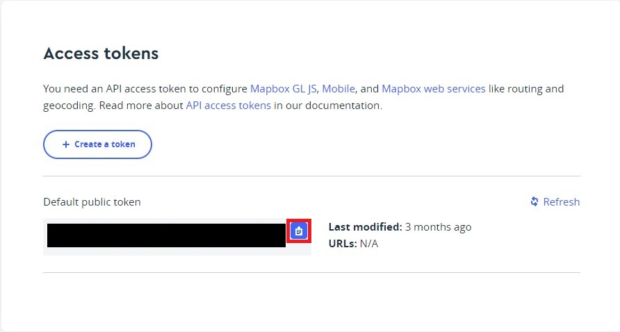

# Data-Viz User Guide

### Table of contents

<!--ts-->

- [Mapbox](#mapbox)
- [BuildingInfo](#buildinginfo)
<!--te-->

### Mapbox

**Step 1: Create Mapbox Account**

- Go to https://www.mapbox.com/.
- Click on 'Sign In'.
- Click on 'Sign up for Mapbox'.

  

**Step 2: Get Mapbox Token**

- Once signed up, you will be directed to the Account Dashboard page.
- Scroll down the page to the 'Access tokens' section and click on the 'Copy' icon next to the link.

  

**Step 3: Link Your Mapbox Token to Data-Viz**

- Open the Data-Viz Unity project.
- Paste the copied token in the input field.
- Click on 'Submit'

  

### BuildingInfo

**Step 1: Open Scene**

- Navigate to 'Assets/BuildingInfo' folder and open the BuildingInfo scene.

**Step 2: Manipulate Camera & Map**

- Click on the left mouse button and drag to pan the map.
- Click on the right mouse button and drag to rotate the camera.
- Use the scroll wheel or the +/- buttons on the top right of the screen to zoom in/out.
- Click on the 'Backgrounds' icon to change the map background.
- Click on the 'Compass' icon to reset the camera positiona and orientation.

  

**Step 2: View Building Info**

- Select building info to display from the dropdown on the top left of the screen.
- Use the two-way slider to filter buildings within the min and max range.
- Hover the mouse pointer over a building to view the building's info.

  
